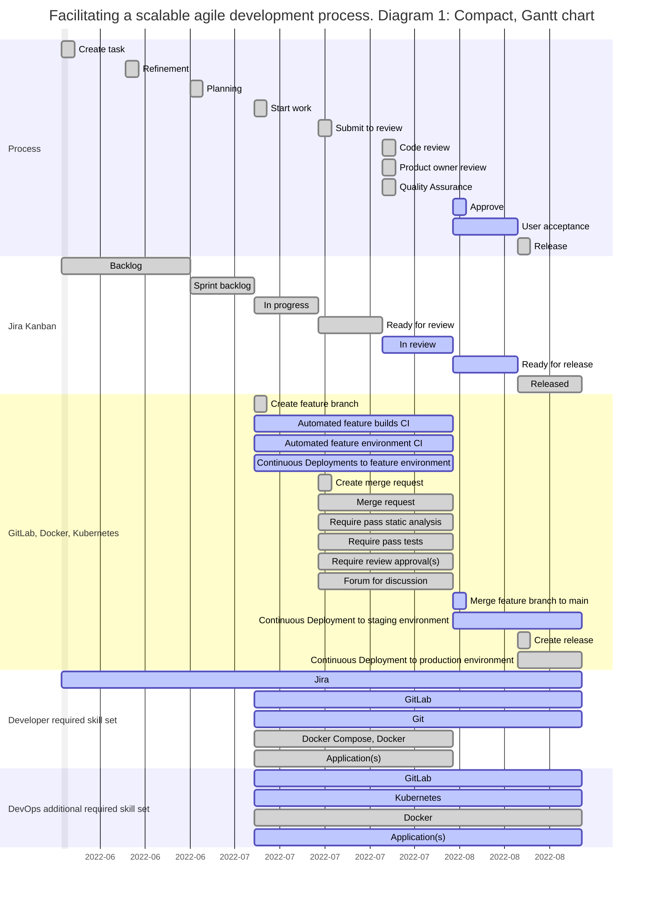
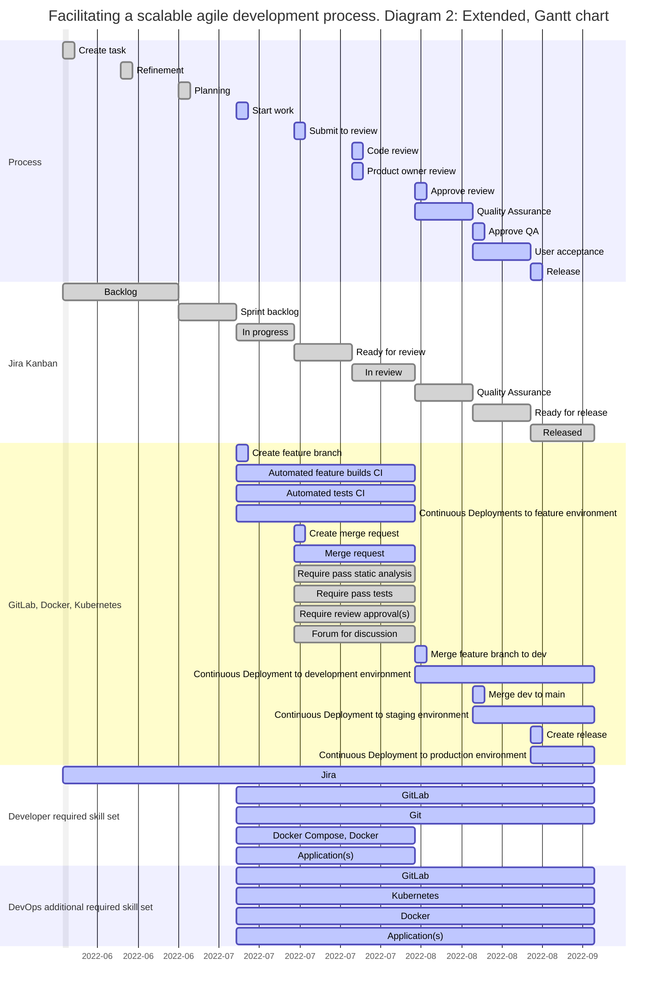

# Facilitating a scalable agile development process with technical integrations

## 1 Description

The goal of this document is to demostrate a way to recognize opportunities for implementation in an agile process.

## 2 Example business case

### 2.1 Goals

- Faster development cycle
- Scalable development process

### 2.2 Solutions

- Agile development process
- CI, CD automation

### 2.3 Added value

- Faster orientation
  - Familiar agile process
  - Reduced tech orientation requirement due to CI, CD automation
  - Reduced skillset requirement due to CI, CD automation
- Scalable development process
  - Asynchronic process support with Jira Kanban, GitLab merge requests and feature environments
  - Transparency and ease of communication with feature environments, GitLab process support and GitLab-Jira integration
- Reduced noise
  - Predictable process
  - Focus on relevant issues due to asynchronous process, CI, CD automation
  - More stable production due to predictable rollout process, reduced manual operation

### 2.4 Technologies

- Jira
- GitLab
- Docker
- Kubernetes

## 3 Diagram 1: Compact

### 3.1 Diagram 1 example implementation

Recognize a step in the process, `Approval`, to coincide with multiple changes to the state of our development technologies.

Define the step `Approve` in our process as the literal act of merging a new feature Merge Request into our main branch in our version control GitLab.

Create automatically triggered integrations into other technologies in our stack using GitLab CI:

- Remove the feature environment cloud resources (GitLab, Kubernetes, RDB, EC2)
- Set the status of the task on the board from In review to Ready for release (GitLab, Jira)
- Build and deploy a new release candidate to user acceptance environment (GitLab, Kubernetes)
- Notify stakeholders of changes to user acceptance environment (GitLab, Slack, email)

### 3.2 Diagram 1 skill sets

The skill set highlights in the diagram represent the highest relevance of a particular skill/technology in the task lifecycle.
Throughout the lifecycle they describe the technology focus change from product development tools to application development technologies and finally to operations technologies, and help in turn highlight potential process steps for automation.

## 4 Diagram 2: Extended

## 5 Technology choices

Continued availability and stability of integrations between technologies are key for long term sustainability of an implemented process.
Every implementation will require maintenance, so the further a process is implemented, the more value low maintenance, easily portable options will produce.

In other words

- Choose technologies that are widely supported and offer standardized integrations.
- Avoid customizations in favor of suggested best practices, standards and conventions.
